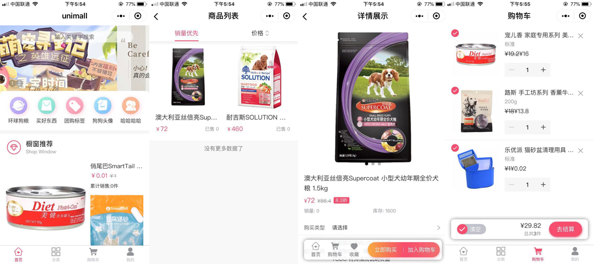
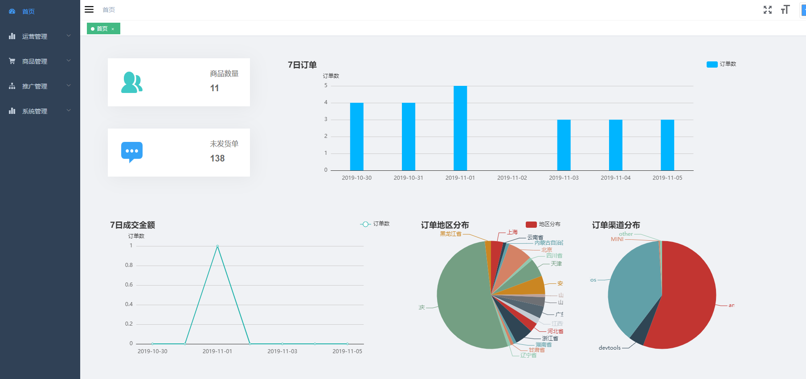
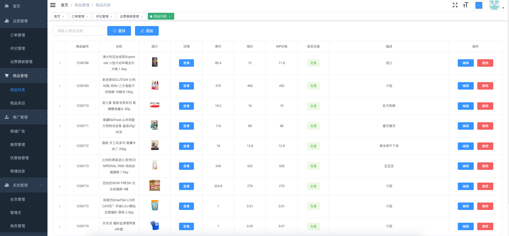
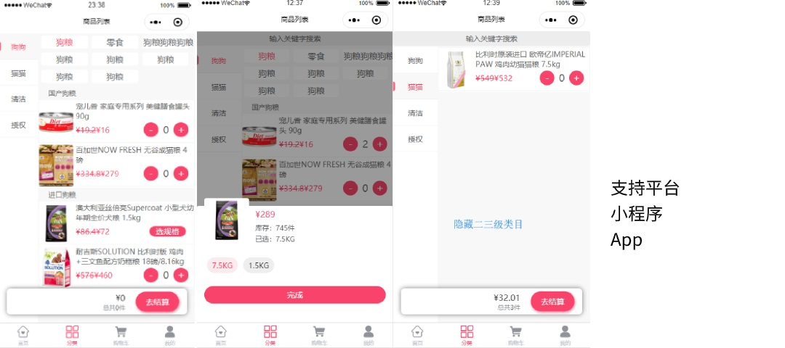
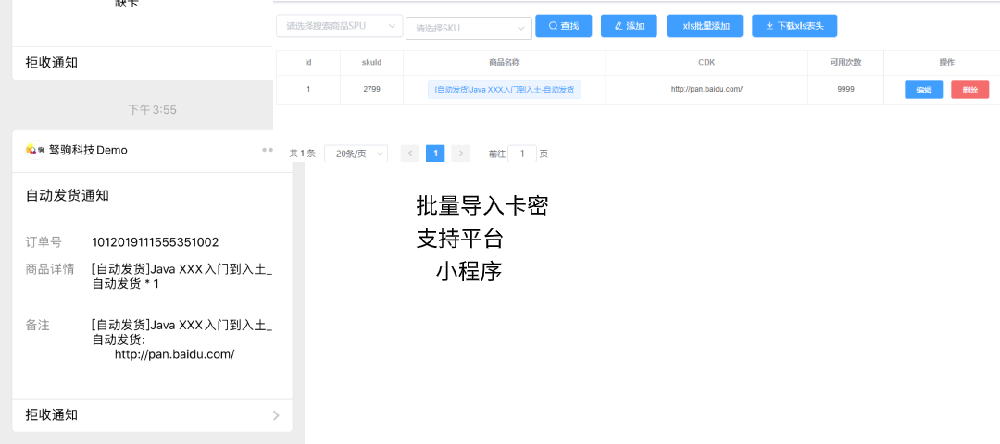
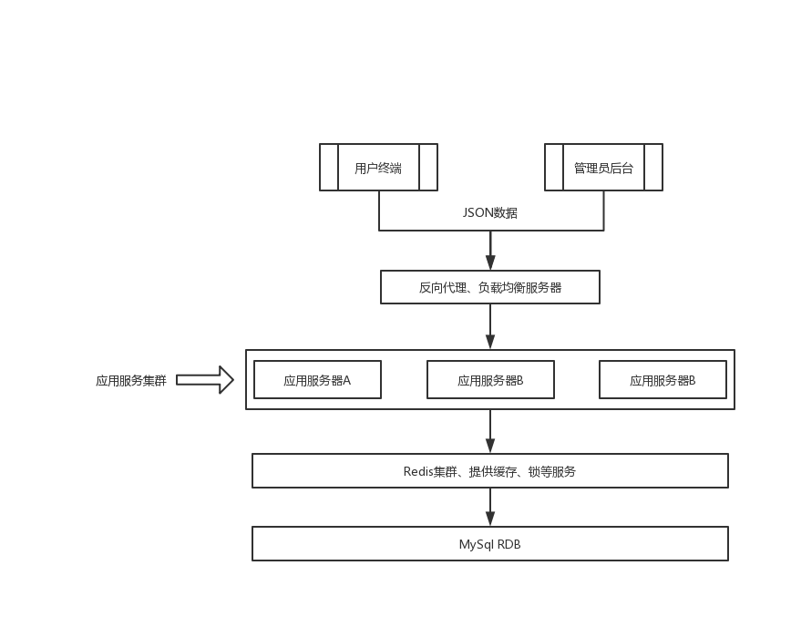
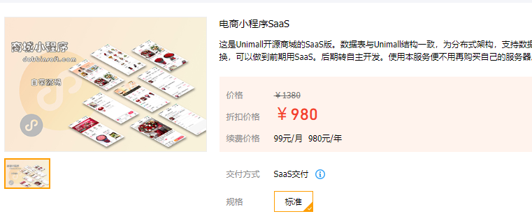

> unimall 针对中小商户、企业和个人学习者开发。使用Java编码，采用SpringBoot、Mybatis-Plus等易用框架，适合个人学习研究。同时支持单机部署、集群部署，中小商户企业可根据业务动态扩容。unimall使用uniapp前端框架，可同时编译到 微信小程序、H5、Android App、iOS App等几个平台，可为中小商户企业节约大量维护成本。也可支撑中小商户企业前期平台横扩需求。

---
QQ讨论群：656676341 (进群前，请在网页右上角点star)
---

#### 优先更新地址

https://gitee.com/iotechn/unimall

#### 用户端系统演示

下面分别是微信小程序包和Android安装Apk。因为苹果开发者ID太贵，所以这里没有打包，实际也可同时支持苹果的。
在这基础上，还增加了H5。可内置到微信公众号上，变成公众号商城！尽情体验！

---

#### 后台端系统演示

- 后台演示地址: [http://admin.unimall.iotechn.com:9527](http://admin.unimall.iotechn.com:9527)
- 登录名:guest   密码:123456   验证码:666666 (guest仅有只读权限)

#### 插件中心

Unimall主程序功能均项目中，包括其基本的订单、商品、广告、优惠券、运费模板、VIP等等功能。后续功能将以插件的形式陆续提供。插件使用主程序模板方法的形式实现。具有自动安装的功能，尽量减少对主代码入侵。插件并无太多学习价值，所以仅对授权用户开放，并且每个插件单独收费。

**1.点餐列表**   部分开发者也许需要点餐列表，用于外卖、社区超市、生鲜线下配送等场景。

**2.自动发货**  部分商家售卖虚拟物品，例如话费、网游充值卡。自创作视频教程等。使用自动发货插件可自动将卡密发送到用户微信上。

更多插件，敬请期待！

#### Unimall 基本框架

Unimall使用前后分离的设计、后端采用Java编写，前端均适用vuejs编写。

#### 项目部署方式

>项目部署

##### ⓪ 服务器推荐
服务器可根据自身业务来选购，单机环境推荐2C4G

##### ① 基础运行环境

| 运行环境 | 版本号 |
|:--------|:--------|
|  MySQL   |  5.7（推荐）   |
|  JDK   |  1.8（推荐）   |
|  Redis   |  4.0.1（其他也可以）   |
|  Nginx  |  只要Web容器就可以了  |

请参考 [CentOS7.4 安装 MySQL5.7](https://github.com/iotechn/document-basic/blob/master/CentOS7.4_Install_MySQL5.7.md)

请参考 [CentOS 安装 JDK8](https://github.com/iotechn/document-basic/blob/master/CentOS_Install_JDK8.md)

请参照CentOS [安装 NodeJs 8.15.0](https://github.com/iotechn/document-basic/blob/master/CentOS_Install_NodeJS_8.15.0.md)

Redis安装可直接使用yum安装 
	
	yum install redis

安装完成后使用 redis-cli 命令，若能进入，则表示redis安装完成

##### ② 后台管理系统编译运行指南

[编译运行指南](doc/run.md)

##### ③ 编译部署前后端代码

项目部署分为 Server 、 App 、 Admin 三个部分

[部署Step1:Java后台编译&部署](doc/server.md)

[部署Step2:App编译打包](doc/app.md)

[部署Step3:Admin编译打包](doc/admin.md)

##### ④ 二次开发文档

[二次开发文档](doc/2develop.md)

#### 版权声明

本项目有重庆驽驹科技有限公司开发，禁止未经授权用于商业用途。个人学习可免费使用。如需商业授权，请进DEMO小程序购买。

本项目有重庆驽驹科技有限公司开发，禁止未经授权用于商业用途。个人学习可免费使用。如需商业授权，请进DEMO小程序购买。

本项目有重庆驽驹科技有限公司开发，禁止未经授权用于商业用途。个人学习可免费使用。如需商业授权，请进DEMO小程序购买。

### 更多服务

### 项目定制开发服务

俗称外包，请加文档顶部的群，联系群主或者管理员（外包不仅限于线上商城）。

### SaaS服务

对于缺少技术的创业团队来说，使用SaaS服务即可解决掉技术问题。简单的说，就是由我们为客户统一运维，每年付一定的钱给我们就行了。

Unimall SaaS版每年980元。这个价格就和服务器的价格差不多，并且<u>**我们还可以免费代申请微信小程序，这可以节约每年300元的认证费**</u>。也就是说你使用SaaS服务之后，还可以省下三四百元每年。

使用Unimall SaaS版的优势：Unimall本身开源，在创业初级技术不足，不足以支撑自主研发。当使用Unimall SaaS累计到一定用户后，可无缝切换到Unimall开源商城，并在此基础上做二次开发。

支持试用：如果您已经有了自己的小程序，直接来试用下吧。微信扫描一下二维码直接购买，可获取免登录链接，或直接PC访问腾讯云市场链接。

腾讯云市场链接：[https://market.cloud.tencent.com/products/18338](https://market.cloud.tencent.com/products/18338)

微信扫码：

