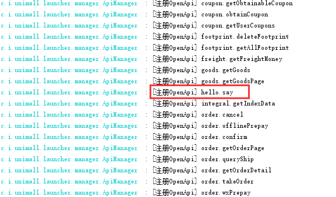
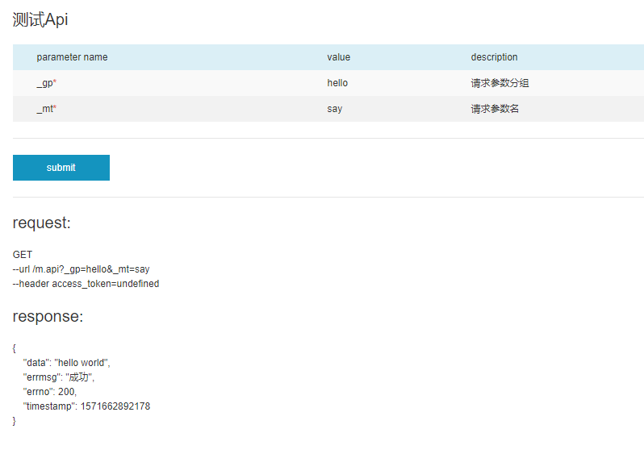
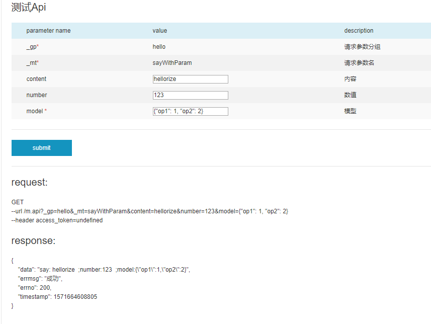
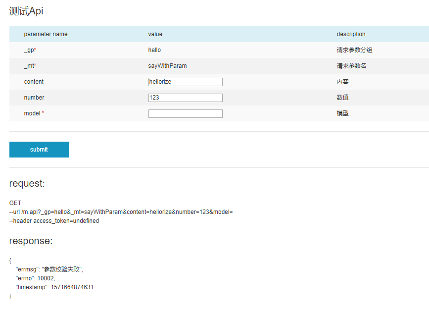
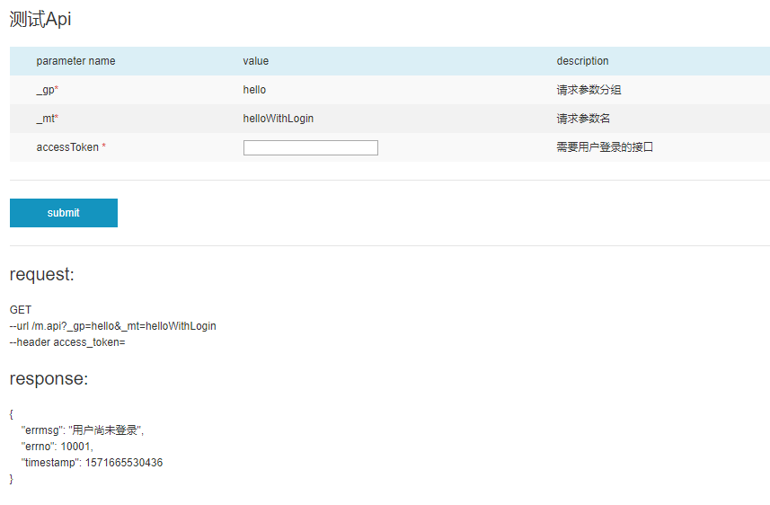
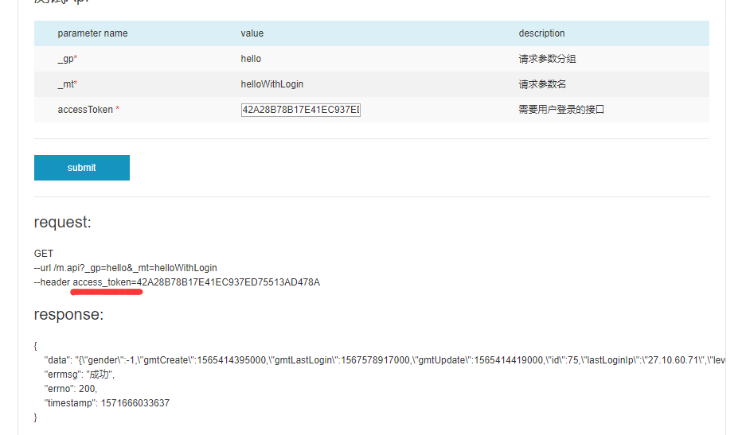

### 概述

 >本文档将依次介绍 unimall二次开发方法、设计思路、统一调用源码解读。

---

unimall项目Gitee地址：[https://gitee.com/iotechn/unimall](https://gitee.com/iotechn/unimall)

本文档不包含 unimall部署方式，部署方式请参考 Gitee 项目根目录 README.md

欢迎加入QQ讨论群：656676341

版权声明：请不要将该私自发送到互联网中。包括QQ群、论坛等。

### 1.二次开发指南

> 一千个人眼中，有一千个哈姆雷特。每个开发这眼中unimall的功能要求都有所不同。必定会涉及到二次开发。

#### 1.1项目结构概述

看过代码的developer都知道，unimall中舍弃了Controller层。转而全面面向服务开发。Service分为暴露到外部的Service 与 不暴露到外部的BizService。BizService中绝对不能依赖Service。而Service中可依赖BizService，不推荐同层依赖。最下面的就是DAO层。

项目目录结构

├─unimall-admin                      
├─unimall-admin-api                       
├─unimall-app  
├─unimall-app-api  
├─unimall-core                          
├─unimall-data                             
└─unimall-launcher

其中admin-api、app-api、core、data、launcher五个module属于Java工程。

core：包括公用工具、公用注解等，每个项目都会用到 
data：存放数据模型，负责数据库访问的封装。例如mysql、redis等。若需要扩展其他类型数据源，也应该封装到此module
api：服务核心逻辑。分别是app和admin的Api。
launcher：唯一可以启动的SpringBoot包。它会去扫描其他包下的Bean并且放入其IoC中。并且所有暴露的OpenApiService都注册在launcher中。launcher负责对请求进行权限鉴定、参数校验、参数转换等。并提供统一的Api调用方式。同时launcher还负责生成Api文档，提供在线调试工具。

PS：测试环境文档演示：[https://fresh.easycampus.cn/info/](https://fresh.easycampus.cn/info/)

###### 异常处理：
Service内不能抛出ServiceException以外的受检异常。若方法内含有受检异常，需将其捕获。对于非受检异常，往外抛出后，最终会被launcher捕获。做同一的处理，日志。

对已知的ServiceException。需要在ExceptionDefinition类中定义相应常量，防止重复使用异常码。

在Service中，不建议直接返回错误结果。应该以异常的形式返回。比如订单没找到，不建议返回null。而是抛出一个订单不在的异常。

    throw new AppServiceException(ExceptionDefinition.ORDER_NOT_EXIST);

#### 1.2.定义自己的服务

##### 1.2.1.hello world

首先定义一个HelloWordService试试水。

首先在 unimall-app-api 模块创建com.iotechn.unimall.app.api.hello包。并创建好HelloService接口。

    @HttpOpenApi(group = "hello", description = "Hello服务")
    public interface HelloService {
    
    }

使用@HttpOpenApi注解在类上来标记，这个接口方法是需要暴露的。并指定好服务的分组。

接着定义具体的方法。

    @HttpOpenApi(group = "hello", description = "Hello服务")
    public interface HelloService { 
    
        @HttpMethod(description = "测试hello接口")    
        public String say() throws ServiceException;
        
    }

需要对此方法加上HttpMethod注解，表示此方法是要暴露的的方法。这样就定义好一个最简单的OpenApi了 ^_^

但是到目前为止，还没有写对应的实现类。在同包下写一个HelloServiceImpl类来实现HelloService。并且此Service实例需要放入IoC中。

    @Service
    public class HelloServiceImpl implements HelloService {    
        @Override    
        public String say() throws ServiceException {       
            return "hello world";   
        }
    }

这样就完成了自己写的一个Api。起动项目。注意起动的是 LauncherApplication 。

查看起动日志中，会发现有新的 api注册。 hello.say

---

##### 1.2.2.Api测试工具

使用Api测试工具测试Api。打开 [http://localhost:8080/info/](http://localhost:8080/info/)

在左侧的面板中找到 hello 组，并且找到say方法。点击‘sumbit’，会得到如下信息。

---

##### 1.2.3参数注入

刚才定义的Api是没有参数传入的。现在来定义个有参数的Api

    @HttpOpenApi(group = "hello", description = "Hello服务")
    public interface HelloService {    
    
        @HttpMethod(description = "带参数Hello")    
        public String sayWithParam(
            @HttpParam(name = "content", type = HttpParamType.COMMON, description = "内容") String content,
            @HttpParam(name = "number", type = HttpParamType.COMMON, description = "数值") Integer number,
            @NotNull  @HttpParam(name = "model", type = HttpParamType.COMMON, description = "模型") HelloServiceImpl.Model model) throws ServiceException;
            
    }
    
这里定义了sayWithParam Api。这里定义了三个入参。分别是三个不同的类型。同样在HelloServiceImpl中实现对应的方法。

    return "say: " + content + "  ;number:" + number + "  ;model:" + JSONObject.toJSONString(model);

重启后使用同样Api测试工具测试。

能够成功得到正确的回复。

注册注意事项：
1.请注意HttpMethod标记的方法 是不支持重载的。因为注册信息中不会保存完整的方法签名。
2.基础数据类型传入，需声明其对应的包装类。
3.Object传入必须要是可以被JSONObject反序列化的对象。
4.编译后会泛型擦除，JSONObect反序列化的时候可能会出错。

---

##### 1.2.4.launcher的参数校验。

之前在 sayWithParam中添加了NotNull的注解。表示launcher会对其进行非空校验。

##### 1.2.5.api 的登录校验

    @HttpMethod(description = "登录测试")
    public String helloWithLogin(        
        @NotNull @HttpParam(name = "userId", type = HttpParamType.USER_ID, description = "用户Id") Long userId) throws ServiceException;

此处定义的参数 type 类型为 USER_ID 。表示注入当前登录的用户的ID。同时launcher中，会将当前用户会话实例，放入SessionUtil中的ThreadLocal中。

    @Override
    public String helloWithLogin(Long userId) throws ServiceException {    
        return JSONObject.toJSONString(SessionUtil.getUser());
    }

使用Api测试工具

当没有放入accessToken，用户直接返回登录失败。这时我们必须先用户登录才能进入方法体。不输入或输入错误的accessToken都会被lanucher拦掉。

在user.login方法中进行登录后，会得到accessToken

输入正确的accessToken后，就可以正确获取结果了，请注意，accessToken是放在Http请求的Header里面的。

##### 1.2.6.admin-api 的权限校验

    @HttpMethod(description = "创建", permission = "operation:category:create", permissionParentName = "商品管理", permissionName = "类目管理")
    public CategoryDO addCategory(
        @NotNull @HttpParam(name = "adminId", type = HttpParamType.ADMIN_ID, description = "管理员ID") Long adminId,                                  
        @NotNull @HttpParam(name = "title", type = HttpParamType.COMMON, description = "类目标题") String title,                              
        @HttpParam(name = "parentId", type = HttpParamType.COMMON, description = "类目父节点",valueDef = "0") Long parentId,                              
        @HttpParam(name = "iconUrl", type = HttpParamType.COMMON, description = "类目图标") String iconUrl,                              
        @HttpParam(name = "picUrl", type = HttpParamType.COMMON, description = "类目图片") String picUrl,                              
        @HttpParam(name = "level", type = HttpParamType.COMMON, description = "类目等级") Integer level) throws ServiceException;

此接口中就包含了管理员权限。lanucher会自动扫描这些注解，形成一个权限列表。管理员绑定的角色，可以关联这些权限。就可以自动在网关上鉴权了。其中HttpParam中的 ADMIN_ID 表示当前登录的管理员信息。和用户原理相同。

### 2.设计思路

#### 2.1.扩展点

unimall为中小公司量身打造。考虑到起步公司的业务发展，也对unimall预留了横向扩展。业务拆分的扩展点。

##### 2.1.1 集群扩展

unimall完全支持集群部署，并推荐大家使用集群部署。前面可自己加nginx等负载均衡，或者 云主机 实例提供商的负载均衡。使用集群部署后，可实现低配版的热部署。一台一台的重启服务，从用户端看仿佛是没有断开服务的。

##### 2.1.2 微服务扩展

当公司发展到一定程度后，可对服务进行拆分。从刚才launcher中可以看出。unimall的设计，已经对服务进行初级分组，划分。并且通过已具备api网关的功能，但是集中式系统里面，说api网关有点作。所以之前没有提。拆分为微服务只需要将实体对象，换成远程调用的代理对象即可。api网关始终会从IoC中去取该接口的实现实例，并不关系实现实例从何而来。

#### 2.2.前后分离

公司发展到一定程度后，也许会放弃uniapp。自己开发前端工程。此时，可完全按照unimall接口来开发。后端完全不需要适配就可以完成前端的重构。

### 3.实现

> 实现上大部分都容易理解，在这里只讲解下 launcher的实现

#### 3.1.注册

首先在core中定义 HttpOpenApi、HttpMethod、HttpParam，用来标记需要被注册的Api。前文已经提到过。

有了core里面的注解，Api 网关便可以扫描这些注解，将这些 OpenApi 的注册信息放入 Api 网关中，下面就来研究一下如何扫描并注册 OpenApi。首先，定义一个 ApiManager 用于管理这些 OpenApi 信息，并将 ApiManager以单例的形式放入Spring IoC容器里面。Spring会帮程序员管理对象的生命周期，包括对象的初始化。所以 ApiManager 实现接口 InitializingBean，实现此接口后，Spring 在为对象注入完参数后，会主动调用此接口方法 afterPropertiesSet()。

    @Override
    public void afterPropertiesSet() throws Exception {
        List<Class> classList = new LinkedList<>();
        String[] serviceArray = applicationContext.getBeanNamesForAnnotation(Service.class);
        for (String service : serviceArray) {
            Object bean = applicationContext.getBean(service);
            Class<?>[] interfaces = bean.getClass().getInterfaces();
            if (interfaces != null && interfaces.length > 0) {
                for (Class clazz : interfaces) { 
                    if (clazz.getAnnotation(HttpOpenApi.class) != null) {
                        classList.add(clazz);               
                    }            
                }        
            }    
        }    
        for (Class clazz : classList) {        
            this.registerService(clazz);    
        }
    }

扫描到所有Service后，再次通过HttpOpenApi过滤。最后在this.registerService(clazz)进行对Api注册。这个代码较长。请去ApiManager类中查看。最后的目的，就是为了生成

    private Map<String, Map<String, Method>> methodCacheMap = new HashMap<>();

通过两次Hash运算，就能找到一个具体的方法。即具体Api。其中Map泛型中第一层是_gp第二层是_mt。

#### 3.2.调用

launcher中有一个ApiController类，用来接收外面的Http请求。大致逻辑是这样，具体代码自己看。

