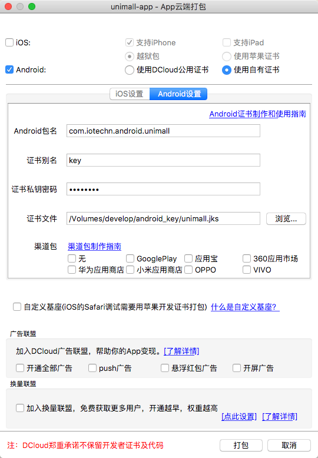

### App

> 服务端部署完成后 用户 小程序 、 App 端才能够顺利运行。App端使用uniapp前端框架编写。

##### ① HBuilderX

HBuilderX 官方网站：[http://www.dcloud.io/hbuilderx.html](http://www.dcloud.io/hbuilderx.html)

支持Windows与MacOS 请下载“App开发版”

在HBuilderX 菜单中选择 文件——导入——从本地目录导入...

选择unimall项目目录中的 unimall-app 即可导入工程进HBuilderX中

##### ② App个性化配置

manifest.json 是uniapp配置文件。

App图标配置，App启动图配置顾名思义就是配置图片和启动图的。

值得注意的是App配置中。
1."APP SDK配置"中登录鉴权的微信登录与支付的微信支付 换成自己微信开放平台的 AppId 和 AppSecret （若需要打包App）
2."微信小程序配置"中微信小程序AppId 换成自己微信公众平台的小程序 AppId

##### ③ 打包微信小程序

> 打包微信小程序请确保PC上已经安装微信开发者工具。并已经打开服务端口。

在HBuilderX菜单中 选择"发行"——"小程序-微信(仅适用于uni-app)"。等待HBuilder编译完成后会跳转到微信开发者工具中。

在微信开发者工具中，选择右上方"上传"并输入版本号，和更新内容简介后即可。最后在微信公众平台提交代码审核即可。

##### ④ 打包App

> 打包App时，Android包名请务必填写自己的，并自己重新生成签名。此签名的指纹必须与微信开放平台一致。否则可能导致App不能微信登录，不能微信支付。

在HBuilderX菜单中 选择"发行"——"原生App-云打包" 勾选自己需要的Android或iOS包。

提交后等待云打包完成。HBuilderX会在控制台打印出App的下载地址。