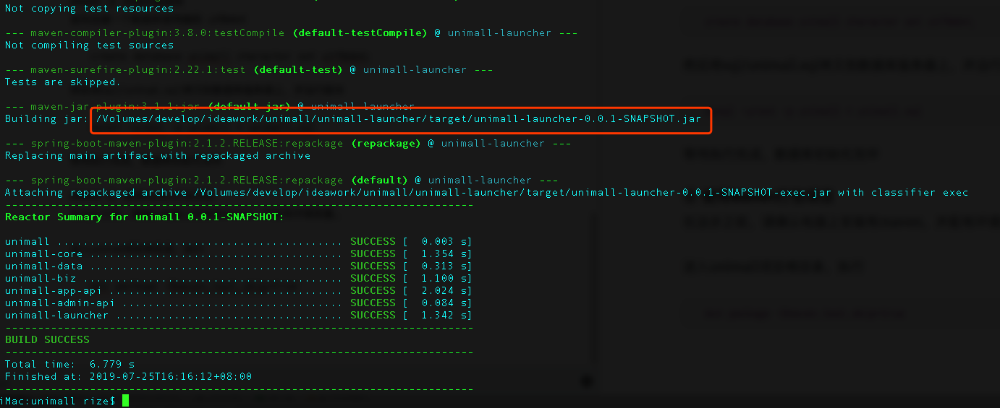

#### Server部署

> 本节介绍服务器端部署方式

##### ① 第三方SDK配置

Unimall运行需要第三方SDK，这些SDK由服务提供商提供，一般会提供其所需要的Key和Secret

| SDK | 备注 |
|:--------|:--------|
|  微信开放平台   |  App端用户微信登录、获取用户基本信息等（不做App可省略，认证微信300）   |
|  微信支付平台   |  用户微信支付付款   |
|  微信公众平台   |  小程序登录、获取用户信息等（认证微信收300）   |
|  腾讯云短信SDK   |  用户手机号注册登录时需要用到（腾讯阿里二选一）   |
|  阿里云短信SDK   |  用户手机号注册登录时需要用到（腾讯阿里二选一）  |
|  阿里云OSS  |  阿里云对象存储，用于存储商品图片、用户评价图片等（每月免费5G流量） |
|  快递鸟SDK  |  用于快递进度查询（没有则查不到物流）  |

请确保有以下东西，就可以部署项目了

	server.port=8080
    
    logging.path=/User/rize/logs
    logging.file=unimall.log
    logging.level.root=info
    
    ########################################################
    ###MySql (MySqlConfiguration)
    ########################################################
    spring.druid.driverClassName=com.mysql.jdbc.Driver
    spring.druid.url=jdbc:mysql://123.207.119.145/unimall?characterEncoding=UTF-8&serverTimezone=Asia/Shanghai
    spring.druid.username=kbq
    spring.druid.password=123456
    spring.druid.maxActive=30
    spring.druid.minIdle=5
    spring.druid.maxWait=10000
    spring.druid.validationQuery="SELECT X"
    
    ########################################################
    ###Redis \u7F13\u5B58\u3001session\u3001lock\u4F7F\u7528\u4E0D\u540C\u6570\u636E\u6E90
    ########################################################
    spring.redis.database=0
    spring.redis.host=127.0.0.1
    spring.redis.port=6379
    #spring.redis.password=1234
    
    spring.user-redis.database=1
    spring.user-redis.host=127.0.0.1
    spring.user-redis.port=6379
    #spring.user-redis.password=1234
    
    spring.lock-redis.database=2
    spring.lock-redis.host=127.0.0.1
    spring.lock-redis.port=6379
    #spring.lock-redis.password=12345
    
    ########################################################
    ###Freemarkder \u6A21\u7248\u5F15\u64CE \u7528\u6237\u751F\u6210Api\u6587\u6863
    ########################################################
    spring.freemarker.request-context-attribute=req
    spring.freemarker.suffix=.html
    spring.freemarker.content-type=text/html
    spring.freemarker.enabled=true
    spring.freemarker.cache=false
    spring.freemarker.template-loader-path=classpath:/templates/
    spring.freemarker.charset=utf-8
    spring.freemarker.settings.number_format=0.##
    
    
    ########################################################
    ### 短信SDK配置 enable 支持 aliyun、qcloud
    ########################################################
    sms.enable=aliyun
    ### 腾讯云短信配置 ###
    sms.qcloud.app-id=1400186792
    sms.qcloud.app-key=31664f74451303e098ca689433477e53
    sms.qcloud.register-template-id=364423
    sms.qcloud.bind-phone-template-id=364423
    sms.qcloud.reset-password-template-id=364423
    sms.qcloud.admin-login-template-id=381839
    ### 阿里云短信配置 ###
    sms.aliyun.accessId=LTAIawEsRQ5noKqG
    sms.aliyun.accessKey=mSvqeIm1qyEwaI0AWu2TXTXgYMcqxg
    sms.aliyun.signature=iotechn
    sms.aliyun.register-template-id=SMS_171851519
    sms.aliyun.bind-phone-template-id=SMS_171851519
    sms.aliyun.reset-password-template-id=SMS_171851519
    sms.aliyun.admin-login-template-id=SMS_171856538
    
    ########################################################
    ###OSS 文件上传配置
    ########################################################
    oss.aliyun.oss.accessId=LTAIawEsRQ5noKqG
    oss.aliyun.oss.accessKey=mSvqeIm1qyEwaI0AWu2TXTXgYMcqxg
    oss.aliyun.oss.endpoint=oss-cn-shenzhen.aliyuncs.com
    oss.aliyun.oss.bucket=unimall-demo
    oss.aliyun.oss.callbackUrl=
    oss.aliyun.oss.dir=imgs/
    oss.aliyun.oss.basekUrl=https://unimall-demo.oss-cn-shenzhen.aliyuncs.com/
    
    ########################################################
    ### 微信APP信息
    ########################################################
    com.iotechn.unimall.wx.mini.app-id=wx19cccd16936e1a91
    com.iotechn.unimall.wx.mini.app-secret=6c91b5af08e39b06b428d8fac333d9c9
    
    com.iotechn.unimall.wx.app.app-id=wx6e1355f89b03fd2e
    com.iotechn.unimall.wx.app.app-secret=013972cce59f480f6ac0890422f1aefd
    
    ########################################################
    ### 微信商户信息
    ########################################################
    com.iotechn.unimall.wx.mch-id=1538757851
    #自己设置的32位码
    com.iotechn.unimall.wx.mch-key=aIt5Vw3cJCXMZS4L5h14kIyDsoXBzo5I
    com.iotechn.unimall.wx.notify-url=http://unimall.free.idcfengye.com/cb/wxpay
    com.iotechn.unimall.wx.key-path=/Users/rize/cert/1538757851_20190609_cert/apiclient_cert.p12
    
    
    ########################################################
    ### 快递查询配置
    ########################################################
    com.iotechn.ship.query.kdn.app-key=1552340
    com.iotechn.ship.query.kdn.business-id=db73dd78-990f-4fc8-ae18-83d0dacf7556
    
    ########################################################
    ### 运行环境配置
    ########################################################
    #机器编号
    com.iotechn.unimall.machine-no=01
    #运行环境 1.开发环境 2.测试环境 3.生产环境
    com.iotechn.unimall.env=1

配置文件位于 /unimall-launcher/src/main/resources/application-prd.properties 将这些信息配置好，就可以了。

注：快递鸟建议重新生成ID。其他敏感数据是无效的，请替换为自己的敏感数据

##### ② 初始化数据库
首先创建一个数据库使用编码 utf8mb4

	create database unimall character set utf8mb4;

然后将sql/unimall.sql拷贝到数据库服务器上，并运行脚本

	mysql -uroot -p unimall < unimall.sql

等待执行完成，数据库初始化完毕

##### ③ 使用Maven打包项目
在这步之前，请确认电脑上安装有maven，并配有环境变量。

进入unimall项目根目录，执行

	mvn package -Dmaven.test.skip=true

打包完成后，会得到这样一个jar包。

将这个jar包复制到服务器上，并使用命令运行（请确保服务器上有JRE运行环境）。

	nohup java -jar unimall-launcher-0.0.1-SNAPSHOT.jar --spring.profiles.active=prd >/dev/null &

运行完后可查看 unimall.log 文件查看日志。

到此处后端代码运行成功！